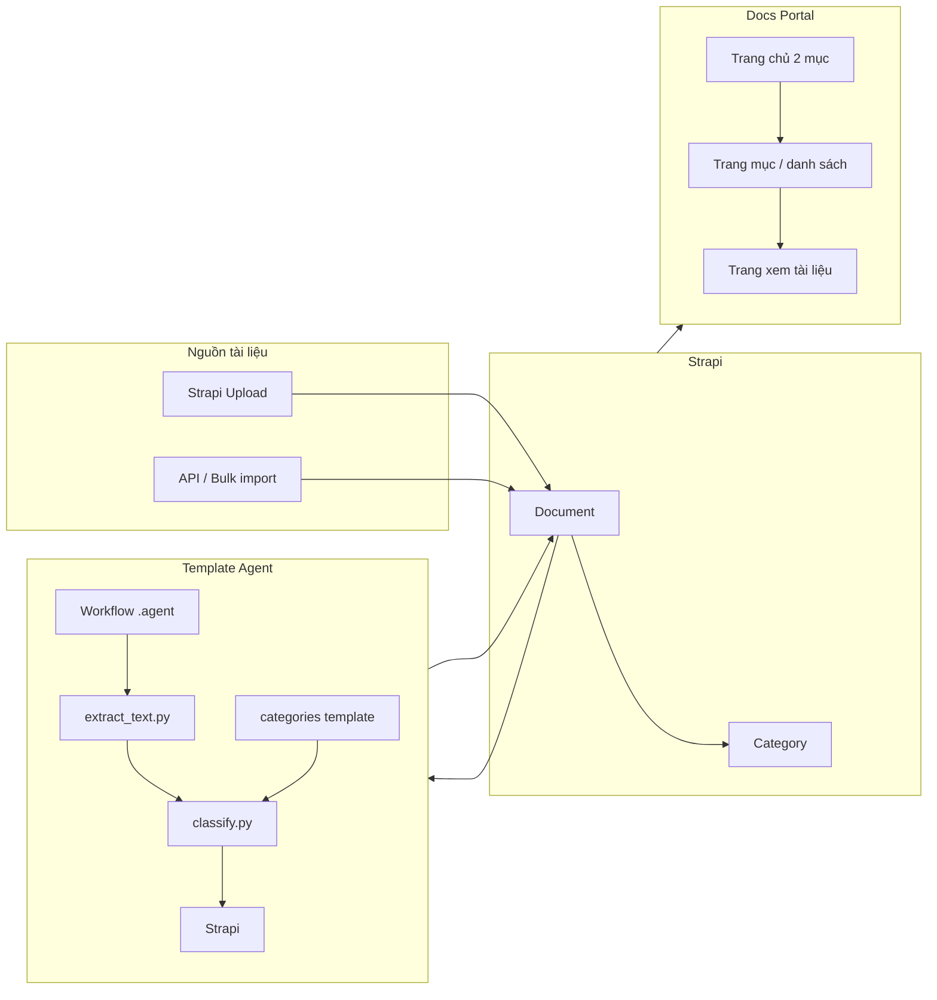

# Kế hoạch: Agent phân loại tài liệu + DB Strapi

## Template mục đích (kiểu support.evgcloud.com)

Template gồm **2 phần chính**, có thể click vào từng phần để sang trang khác:

| Phần              | Mô tả                                         | Khi click                                                             |
| ----------------- | --------------------------------------------- | --------------------------------------------------------------------- |
| **User Guide**    | Hướng dẫn sử dụng, getting started, tutorials | → Trang liệt kê (sub-mục hoặc danh sách tài liệu thuộc User Guide)    |
| **API Reference** | Tài liệu API, endpoints, tham số              | → Trang liệt kê (sub-mục hoặc danh sách tài liệu thuộc API Reference) |

- Agent **tự tạo ra từng mục**: LLM có thể đề xuất tên mục mới (slug/name); nếu mục chưa tồn tại trong Strapi thì agent gọi API tạo category rồi gán document vào. Không bắt buộc chỉ dùng 2 mục cố định (User Guide / API Reference).
- Người dùng vào **portal**: thấy các mục (do agent tạo + phân loại) → click mục → trang danh sách tài liệu → click tài liệu → **xem nội dung trực tiếp trên web** (PDF viewer, markdown render, text) và có link tải nếu cần.

---

## Tổng quan kiến trúc

- **Strapi**: Lưu tài liệu (Document) và mục (Category); nhận upload + API.
- **Template agent**: Script đọc nội dung → LLM **đề xuất hoặc chọn mục** (có thể là mục mới). Nếu mục chưa có trong Strapi → agent **tạo category** (POST /api/categories) rồi gán document (PATCH). Agent tự tạo ra từng mục theo nội dung tài liệu.
- **Docs Portal**: Viết code để **hiển thị tài liệu trực tiếp trên web**: plugin [docs-portal](agent/src/plugins/docs-portal/) đọc Document + Category từ Strapi; trang chi tiết tài liệu có **viewer inline** (PDF, Markdown, text) thay vì chỉ link tải.

---

## Cách dùng agent (luồng người dùng)

Agent ở đây là **workflow n8n** tự động phân loại tài liệu và cập nhật lại Strapi.

**Bước 1 – Đưa tài liệu vào**

- **Cách A**: Vào Strapi Admin → tạo Document mới → upload file (PDF, DOC, MD, …), để **Category** trống (chưa phân loại).
- **Cách B**: Gọi API tạo Document (hoặc bulk import) với file đính kèm, `category = null`.

**Bước 2 – n8n chạy phân loại**

- **Trigger**: webhook từ Strapi (khuyến nghị) hoặc schedule/cron.
- n8n thực hiện: GET documents chưa phân loại → tải file → extract text → gọi LLM **đề xuất tên/slug mục** (có thể mới). Nếu mục chưa có → POST Strapi tạo category → PATCH document gán category.

**Bước 3 – Xem kết quả**

- Mở **Docs Portal** (URL do Strapi + plugin docs-portal phục vụ).
- Sidebar hiển thị **các mục** (do agent tạo); click mục → danh sách tài liệu; click tài liệu → **xem nội dung trực tiếp trên web** (PDF/MD/text viewer) và link tải.

**Tóm tắt**: Upload (Strapi) → n8n tự phân loại & PATCH Strapi → vào docs-portal xem theo mục.

---

## Dùng n8n làm agent

**Có thể dùng n8n** làm “agent” phân loại: toàn bộ luồng chạy trong workflow n8n, không cần Cursor chat.

**Luồng n8n gợi ý**

1. **Trigger**
  - **Webhook**: Strapi gọi webhook n8n khi tạo Document (lifecycle `afterCreate` hoặc custom endpoint gọi ra n8n).
  - **Schedule**: Cron (ví dụ mỗi 5 phút) kiểm tra document chưa có category.
  - **Manual**: Chạy workflow thủ công khi cần.
2. **Lấy document chưa phân loại**
  HTTP Request → `GET {STRAPI_URL}/api/documents?filters[category][\$null]=true` (và populate file).
3. **Loop từng document**
  - Lấy URL file (Strapi trả về `file.url`).
  - Tải file (HTTP Request) hoặc lấy binary.
4. **Extract text**
  - **Cách A**: Nút **Execute Command** gọi `python3 extract_text.py <file_path>` (file tạm lưu từ n8n).
  - **Cách B**: HTTP gọi một service (Node/Python) đã deploy sẵn nhận file → trả về text.
  - **Cách C**: Chỉ dùng với file text/markdown: đọc trực tiếp trong n8n (Code node).
5. **Phân loại / tạo mục bằng LLM**
  Nút **OpenAI**: prompt kiểu “Dựa vào nội dung, đề xuất 1 mục (tên ngắn, slug dạng lowercase-dash). Trả về JSON: { name: ..., slug: ... }. Có thể là mục mới.”; parse response → name, slug.
6. **Đảm bảo category tồn tại**
  GET categories; nếu slug chưa có → POST `{STRAPI_URL}/api/categories` với `{ name, slug }` → lấy id. Nếu đã có → lấy id từ danh sách.
7. **Cập nhật Strapi**
  HTTP Request → `PATCH {STRAPI_URL}/api/documents/{{ $json.documentId }}` với body `{ category: <categoryId> }`.

**Cách dùng khi agent là n8n**

- Upload tài liệu trong Strapi (category để trống).
- n8n chạy (webhook / schedule / manual) → workflow phân loại và PATCH Strapi.
- Vào Docs Portal xem tài liệu đã được gán đúng mục.

n8n chạy tự động (webhook/schedule) hoặc manual; không cần chat hay IDE.

---

## Dùng MCP với agent

**Có thể dùng MCP** để “agent” thao tác với Strapi và phân loại qua **tools** (thay vì workflow node rời rạc).

**Hướng 1 – MCP server cho Document/Strapi (khuyến nghị nếu muốn agent “gọi tool”)**

- Tạo một **MCP server** (Node hoặc Python) expose các tool cho agent:
  - `list_unclassified_documents` – gọi Strapi GET documents (category null).
  - `get_categories` – GET categories (để LLM biết slug: user-guide, api-reference).
  - `classify_document` – nhận documentId (hoặc file URL), text (hoặc để server tự extract); gọi LLM classify; PATCH Strapi gán category.
- Client (n8n hoặc tool khác) gọi MCP tools: `list_unclassified_documents` → với mỗi doc gọi `classify_document` (trong tool đã gói sẵn extract + LLM + tạo category nếu cần + PATCH).
- **Lợi ích**: Workflow trong chat gọn, tái sử dụng tool; không cần agent tự viết curl/chạy Python từng bước.

**Hướng 2 – Dùng RAGflow MCP (nếu có RAGflow trong workspace)**

- [RAGflow](https://github.com/infiniflow/ragflow) có MCP server (search knowledge base). Có thể:
  - Dùng tool search RAGflow để tham khảo tài liệu tương tự khi phân loại (optional).
  - Hoặc sau khi extract text, đẩy nội dung vào RAGflow qua API/MCP (nếu cần search sau này).
- Agent phân loại vẫn chủ yếu dùng Strapi (Document/Category); RAGflow MCP là bổ trợ.

**Trạng thái hiện tại**: Trong project [agent](agent/) chưa có MCP server. Nếu triển khai Hướng 1 thì thêm một MCP server (ví dụ trong `agent/mcp/` hoặc repo riêng). n8n có thể gọi các tool MCP này (qua HTTP) như một lớp service chuẩn hoá.

---

## 1. Database Strapi – Content types

Tạo trong `agent` (Strapi 5), thư mục chuẩn `src/api/<name>/content-types/<name>/schema.json`.

### 1.1 Content-type **Category** (mục)

- **Bảng**: `categories`
- **Thuộc tính**:
  - `name` (string, required)
  - `slug` (string, unique, dùng cho API/filter)
  - `description` (text, optional – mô tả mục để LLM hiểu)
  - `parent` (relation manyToOne → Category, optional – mục cha)
  - `order` (integer, default 0 – sắp xếp)
- **Quan hệ**: Category `oneToMany` → Document (một mục có nhiều tài liệu).

### 1.2 Content-type **Document** (tài liệu)

- **Bảng**: `documents`
- **Thuộc tính**:
  - `title` (string)
  - `file` (media, single – dùng plugin upload: `plugin::upload.file`)
  - `category` (relation manyToOne → Category – mục được gán)
  - `extracted_text` (text, optional – text trích từ file để LLM đọc và search)
  - `classification_confidence` (float, optional – độ tin cậy 0–1)
  - `classified_at` (datetime, optional)
  - `source` (enumeration: `manual_upload` | `api_import`)
  - `metadata` (JSON, optional – tên file gốc, MIME, v.v.)
- **Quan hệ**: Document manyToOne → Category.

Tạo đủ controller/routes/services cho `category` và `document` theo cấu trúc hiện có (ví dụ [conversation](agent/src/api/conversation/)).

---

## 2. API Strapi cho Document

- **REST/GraphQL** (tùy cấu hình Strapi): CRUD Document, CRUD Category.
- **Upload**: Document dùng field `file` (Strapi upload plugin) – upload qua Admin hoặc qua API (multipart) khi tạo Document.
- **Bulk import**: Endpoint tùy chọn, ví dụ `POST /api/documents/import` (hoặc custom route):
  - Nhận file hoặc URL/danh sách file;
  - Tạo bản ghi Document (file + `source: api_import`, `category: null`);
  - Trả về danh sách document id để workflow/script xử lý phân loại.

Cấu hình quyền (Permissions) cho API Document/Category (authenticated hoặc API token tùy môi trường).

---

## 2.1 Docs Portal – Hiển thị tài liệu trực tiếp trên web

**Luồng**: Agent tạo mục + phân loại → dữ liệu trong Strapi. Plugin [docs-portal](agent/src/plugins/docs-portal/) **đọc** Document + Category từ Strapi; **viết code để hiển thị nội dung tài liệu trực tiếp trên web** (viewer inline), không chỉ link tải.

**Hiện trạng plugin docs-portal** (build mẫu):

- **Client**: Vite + React; Sidebar hardcoded 2 nhóm; App render sections tĩnh.
- **Server**: Serve build client tại root.

**Thay đổi cần làm**:

1. **Nguồn dữ liệu động**: Sidebar và danh sách **lấy từ Strapi** (GET categories, GET documents theo category). Sidebar render **tất cả mục** (do agent tự tạo), mỗi mục link tới `/category/:slug`.
2. **Routing**: Trang chủ (danh sách mục) → `/category/:slug` (danh sách tài liệu) → `/document/:id` (trang xem nội dung).
3. **Hiển thị tài liệu trực tiếp trên web** (trang `/document/:id`):
  - **PDF**: Embed viewer trên trang (ví dụ `react-pdf` hoặc `<iframe src={fileUrl}>` nếu browser hỗ trợ; hoặc PDF.js) để xem PDF ngay trong trình duyệt.
  - **Markdown**: Render nội dung từ `extracted_text` hoặc từ file .md (fetch raw) bằng thư viện `react-markdown` (và syntax highlighting nếu cần).
  - **Text**: Hiển thị `extracted_text` (hoặc nội dung file text) trong khung scroll (pre/code hoặc div có style đọc dễ).
  - **DOC/DOCX**: Có thể hiển thị `extracted_text` đã lưu khi phân loại (dạng text thuần) hoặc chỉ hiện link tải file (render DOCX trực tiếp trên web phức tạp).
  - Luôn có **link tải file** (download) bên cạnh viewer.

Kết quả: Người dùng click tài liệu → **xem nội dung ngay trên web** (PDF/MD/text); mục hiển thị là các mục do agent tự tạo.

---

## 3. Template phân loại (theo cấu trúc [agent/template](agent/template))

Tạo thư mục và file tương tự template UI/UX: workflow + script + data.

### 3.1 Mục do agent tự tạo (và danh sách gợi ý tùy chọn)

- **Agent tự tạo từng mục**: LLM đề xuất `name` + `slug` từ nội dung tài liệu; nếu slug chưa tồn tại trong Strapi thì workflow/script gọi **POST /api/categories** tạo mục mới, sau đó PATCH document gán vào mục đó.
- **File gợi ý** (tùy chọn): `agent/template/.shared/document-classifier/data/categories.json` – danh sách mục có sẵn để LLM **có thể chọn** hoặc tham khảo; LLM vẫn được phép trả về mục mới (name/slug) chưa có trong file.
- Ví dụ prompt: “Dựa vào nội dung, chọn 1 mục từ danh sách HOẶC đề xuất mục mới (name, slug). Trả về JSON: { name: ..., slug: ... }.”
- Sau bước classify: GET Strapi categories; nếu `slug` chưa có → POST category → lấy id; PATCH document với category id.

### 3.2 Script trích xuất nội dung (extract_text)

- **File**: `agent/template/.shared/document-classifier/scripts/extract_text.py`
- **Chức năng**: Nhận đường dẫn file (hoặc buffer); đọc theo extension (`.pdf`, `.docx`, `.md`, `.txt`, …); trả về plain text.
- **Thư viện gợi ý**: `pypdf` hoặc `pdfplumber` (PDF), `python-docx` (DOCX), đọc trực tiếp (MD, TXT). Có thể bọc try/except theo từng loại, trả về lỗi rõ ràng.
- **Output**: Text (stdout hoặc file) để đưa vào bước classify. Giới hạn độ dài (ví dụ 8k–12k ký tự) trước khi gửi LLM để tránh vượt context.

### 3.3 Script phân loại / đề xuất mục bằng LLM (classify)

- **File**: `agent/template/.shared/document-classifier/scripts/classify.py`
- **Input**: (1) Đoạn text (từ extract_text), (2) danh sách categories hiện có (từ Strapi GET hoặc `categories.json`, tùy chọn).
- **Chức năng**: Gọi LLM với prompt dạng: “Dựa vào nội dung, chọn 1 mục từ danh sách HOẶC đề xuất mục mới. Trả về JSON: { name: Tên mục, slug: slug-muc }.” (slug: lowercase, dấu gạch ngang).
- **Output**: `name` + `slug` (và optional confidence); in ra JSON để bước sau: nếu slug chưa có trong Strapi thì tạo category (POST), rồi PATCH document.
- **Cấu hình**: API key, base URL (env); không hardcode secret.

### 3.4 Workflow agent (.agent)

- **File**: `agent/template/.agent/workflows/document-classifier.md`
- **Nội dung** (mô tả bước cho workflow/n8n):
  1. GET documents chưa phân loại (category = null) từ Strapi.
  2. Với mỗi document: lấy file → `extract_text.py` → text.
  3. Gọi `classify.py` với text (và danh sách categories hiện có, tùy chọn) → nhận `name`, `slug`.
  4. GET Strapi categories; nếu `slug` chưa tồn tại → **POST /api/categories** tạo mục mới (`name`, `slug`), lấy category id; nếu đã có thì lấy id.
  5. PATCH document: gán `category` (id), `classified_at`, `classification_confidence`.
- Agent **tự tạo ra từng mục** khi LLM đề xuất mục mới.

---

## 4. Tích hợp upload với phân loại (tự động hoặc thủ công)

- **Option A – Thủ công**: User upload trong Strapi → tạo Document (category = null). Sau đó user yêu cầu agent “phân loại tài liệu chưa gán mục” → workflow chạy như trên.
- **Option B – Bán tự động**: Strapi lifecycle hook `afterCreate` của Document: gọi internal endpoint hoặc đẩy job (ví dụ queue) để chạy script classify (cần Strapi có thể gọi Python hoặc worker). Plan triển khai trước: Option A (workflow thủ công); Option B có thể ghi trong plan là bước mở rộng.

---

## 5. Công nghệ và phụ thuộc

- **Strapi**: Giữ nguyên stack hiện tại (Node 20+, Strapi 5, MySQL/SQLite theo config).
- **Python**: Python 3.10+ cho script; dependencies gợi ý: `pypdf` hoặc `pdfplumber`, `python-docx`, `requests` (gọi Strapi API + LLM API). File `requirements.txt` trong `template/.shared/document-classifier/`.
- **LLM**: API OpenAI hoặc tương thích (env: `OPENAI_API_KEY`, `OPENAI_BASE_URL` nếu dùng proxy/local model).

---

## 6. Thứ tự triển khai đề xuất

1. **Strapi**: Tạo content-types Category và Document (schema, controller, routes, services); cấu hình permissions.
2. **Template data**: Tạo `categories.json` với 2 mục **User Guide** và **API Reference**; (tùy chọn) script seed categories vào Strapi.
3. **Script**: `extract_text.py` hỗ trợ PDF, DOCX, MD, TXT.
4. **Script**: `classify.py` đọc categories, gọi LLM, trả về slug (user-guide / api-reference hoặc sub-mục), confidence.
5. **Workflow**: Viết `document-classifier.md` gọi script + Strapi API theo đúng thứ tự trên.
6. **Docs Portal**: Chỉnh plugin [docs-portal](agent/src/plugins/docs-portal/) để (1) đọc Document + Category từ Strapi, Sidebar động theo mục do agent tạo; (2) **viết code hiển thị tài liệu trực tiếp trên web**: trang `/document/:id` có viewer inline cho PDF (iframe/react-pdf), Markdown (react-markdown), text (extracted_text); luôn có link tải file.
7. **Bulk import** (tùy chọn): Custom route `POST /api/documents/import` nhận file và tạo Document với `source: api_import`.
8. **n8n** (tùy chọn): Tạo workflow n8n theo mục “Dùng n8n làm agent” (trigger webhook / schedule / manual; GET documents → extract text → LLM đề xuất mục → tạo category nếu chưa có → PATCH Strapi).

Sau khi có plan chi tiết, bắt đầu từ bước 1 (Strapi schema + API) → template (script + workflow, agent tự tạo mục) → Docs Portal (viewer hiển thị tài liệu trực tiếp trên web). Agent = n8n (hoặc MCP).